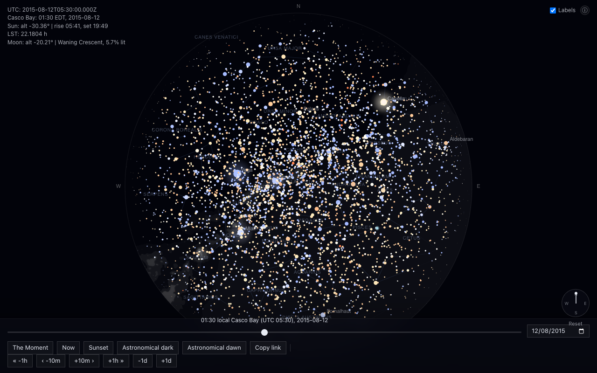

# Pole Island Sky

A pixel-accurate recreation of the night sky Alan Lightman describes from
his island in Casco Bay, Maine, in *Searching for Stars on an Island in
Maine* (2018) — real star positions, real planet positions, a real moon
phase, scrubbable through time.

**Live**: not yet deployed from this environment (no GitHub/Vercel
authentication available here) — see [Deploy](#deploy) below for the exact
commands to finish it. Intended URL once DNS is attached:
`https://pole-island.adidevpanday.com`.



## What this is

Everything renders from real astronomy: `astronomy-engine` for time and
coordinate transforms, the HYG star catalog for ~8,900 naked-eye stars,
Stellarium's constellation figures, and d3-celestial's Milky Way outline —
the same kind of math underlying planetarium software, not an illustration.
Location is a public proxy for Lightman's unnamed 30-acre island (he
doesn't disclose which one); the date/time is scrubbable, with a scripted
"The Moment" opening for the specific wee-hours scene the book describes.

## Local development

```bash
npm install
npm run build:data   # first time only - downloads/builds the star catalog, constellations, Milky Way
npm run dev
```

Open http://localhost:3000 for the sky, http://localhost:3000/verify for
the astronomy-accuracy verification table.

```bash
npm run build       # production build
npm run lint         # ESLint
npm run test          # Vitest
npx tsc --noEmit       # type-check
npm run build:data      # regenerate data/*.json + public/data/*.json from source
```

`build:data` (`build:stars` + `build:constellations` + `build:milkyway`)
only needs to run again if you want to refresh from upstream (new HYG
release, filter changes) — the generated files are committed, so a fresh
clone already has them.

## Stack

- Next.js 15 (App Router) + TypeScript + Tailwind + ESLint
- [`astronomy-engine`](https://github.com/cosinekitty/astronomy) (MIT) for
  all time and coordinate transforms
- [HYG star catalog v4.1](https://codeberg.org/astronexus/hyg) (Astronexus
  / David Nash, **CC BY-SA 4.0** — not public domain, despite what an
  earlier version of this README and this project's original spec assumed;
  corrected after actually reading the license file), filtered to the
  naked-eye subset (mag &le; 6.5)
- Constellation line figures from
  [Stellarium](https://github.com/Stellarium/stellarium)'s modern skyculture
  (`skycultures/modern/constellationship.fab` +
  `constellation_names.eng.fab`, tag `v1.2` — later releases moved this data
  to a JSON format at a different path). GPL-2; a factual line-segment/name
  table, credited here per its license.
- Milky Way outline from
  [d3-celestial](https://github.com/ofrohn/d3-celestial) (Olaf Frohn)
  `data/mw.json` (5 GeoJSON brightness contours, J2000 equatorial). BSD-3.
- Canvas 2D for rendering
- Vitest for unit tests

## Key files

- `lib/observer.ts` — `POLE_ISLAND` (observer location, a placeholder proxy
  for Lightman's unnamed 30-acre island) and `REFERENCE_MOMENT` (a
  placeholder date/time for the night described in the book — not stated in
  the book itself)
- `lib/sky.ts` — `computeAltAz` (astronomy-engine `Body` or J2000
  `{ raHours, decDegrees }` &rarr; topocentric alt/az, optional refraction
  override), `applyProperMotion` and `computeStarAltAz` for catalog stars,
  `computeLocalSiderealTime`, `moonPhaseName`
- `lib/time.ts` — dependency-free `America/New_York` local-time helpers
- `lib/projection.ts` — zenith-centered stereographic projection (alt/az
  &rarr; canvas pixels), with `rotationDeg` (compass rotation) and an
  unclamped variant for off-screen anchors, unit-tested
- `lib/labels.ts` — curated always-labeled star list and label thresholds
- `lib/starColor.ts` — `bvToRgb`, piecewise-linear B-V &rarr; RGB, unit-tested
  and cross-checked against real rendered canvas pixels
- `lib/extinction.ts` — atmospheric extinction (Kasten &amp; Young 1989) and
  horizon-fade factor
- `lib/twilight.ts` — smoothly-interpolated dawn/dusk sky gradient
- `lib/ogImage.tsx` — shared JSX for the Open Graph / Twitter share images
- `scripts/lib/cache.ts` — shared download/cache helper for the three
  `build:*` scripts
- `scripts/build-star-catalog.ts`, `build-constellations.ts`,
  `build-milkyway.ts` — download/cache upstream data and write
  `data/*.json` + `public/data/*.json`
- `components/SkyCanvas.tsx` — the canvas: background, twilight gradient,
  Milky Way, constellation lines, stars, planets, Sun, Moon, labels, scene
  pointers, horizon circle. Astronomy recompute is throttled to 30/sec via
  `requestAnimationFrame`; rotation/labels/pointer-opacity changes redraw
  without recomputing. `?stats=1` shows a frame-time/recompute-time/star-count
  overlay
- `components/TimeControls.tsx`, `CompassDial.tsx`, `TopRightControls.tsx`,
  `AboutPanel.tsx`, `BoatVignette.tsx`, `SceneCard.tsx` — UI chrome, all
  responsive down to iPhone SE width
- `hooks/useSceneController.ts` — drives "The Moment"'s scripted opening
- `hooks/useIsMobile.ts` — shared narrow-viewport check
- `data/passages.json` — 3 placeholder (paraphrase) excerpts, schema-ready
  for real quotes; not yet wired into any UI (the scene card's text is
  hardcoded per the spec that introduced it)
- `components/SkyExperience.tsx` — owns app state, wires everything
  together, syncs `?t=<ISO>` in the URL
- `app/layout.tsx` — metadata (title/description/OpenGraph/Twitter/robots),
  `viewport` (theme color)
- `app/icon.tsx`, `apple-icon.tsx` — dynamic favicon (a single 4-point star)
- `app/opengraph-image.tsx`, `twitter-image.tsx` — share-card images
  (deterministic pseudo-random star field, fixed seed)
- `app/sitemap.ts`, `robots.ts` — SEO routes
- `app/verify/page.tsx` — the original astronomy-accuracy verification
  table, kept as a running record with cross-checks and known
  spec/reality mismatches noted in comments

## Deploy

This repo targets [Vercel](https://vercel.com) (Next.js autodetected, no
custom build config beyond `vercel.json`'s cache headers for `/data/*.json`
and `regions: ["iad1"]`). To finish deploying from scratch:

```bash
# 1. Push to GitHub (repo doesn't exist yet from this environment)
gh repo create adipanday/pole-island-sky --public --source=. --push
# (or create it manually on github.com and `git remote add origin <url> && git push -u origin main`)

# 2. Install the Vercel CLI if you don't have it
npm i -g vercel

# 3. Log in and deploy
vercel login
vercel --prod   # first run asks for scope + project name; use "pole-island-sky"
```

### Custom domain

Once deployed, to attach `pole-island.adidevpanday.com`:

1. At your DNS registrar, add: `CNAME pole-island cname.vercel-dns.com`
2. `vercel domains add pole-island.adidevpanday.com`
3. Verify propagation: `dig pole-island.adidevpanday.com CNAME`

### Post-deploy checklist

```bash
curl -sI https://<your-deployment>/                          # expect 200, text/html
curl -s  https://<your-deployment>/data/stars.json | jq '.count'  # expect 8920
curl -sI https://<your-deployment>/opengraph-image             # expect 200, image/png
curl -sI https://<your-deployment>/robots.txt                  # expect 200, body has "Sitemap:"
npx lighthouse https://<your-deployment> --only-categories=performance,seo,accessibility \
  --preset=mobile --output=json --output-path=./lighthouse.json --chrome-flags="--headless"
```

## License

Code: MIT (see `LICENSE`). Redistributed data files under `data/` and
`public/data/` keep their own upstream licenses — HYG (CC BY-SA 4.0),
Stellarium constellation figures (GPL-2), d3-celestial Milky Way outline
(BSD-3). Full texts and a per-file breakdown: [`LICENSES/`](LICENSES/).

## Credits

- [astronomy-engine](https://github.com/cosinekitty/astronomy) — Don Cross
- [HYG star database](https://codeberg.org/astronexus/hyg) — Astronexus,
  David Nash
- [Stellarium](https://github.com/Stellarium/stellarium) constellation
  figures
- [d3-celestial](https://github.com/ofrohn/d3-celestial) Milky Way outline
  — Olaf Frohn
- Alan Lightman, *Searching for Stars on an Island in Maine* (2018) — the
  book this whole thing is a tribute to

---

By Adi Panday for Dr. Alan Lightman, 2026.
